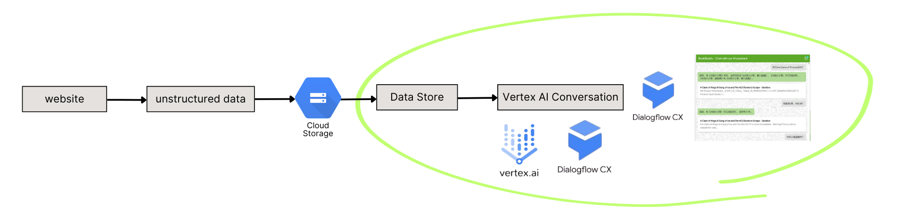

# Book Buddy

## 1. Introduction

Book Buddy is a web app that demonstrates the capabilities of
[Vertex AI Agent Builder](https://cloud.google.com/products/agent-builder)
that is built on top of functionality in
[Conversational Agents and Dialogflow](https://cloud.google.com/products/conversational-agents).


Using a Data Store Agent, you have the ability to input a website domain, structured data, or unstructured data, after which the Agent processes your content to generate a virtual agent fueled by data stores and extensive language models. This enables your customers and end users to engage in conversations with the agent, asking questions pertaining to book recommendations and literature information.



For detailed information about how to set up the agent, please refer to this Medium article: [How to build your own AI Chatbot within 5 minutes using Google LLM and your private knowledge?](https://medium.com/@lizhuohang.selina/how-to-build-your-own-ai-chatbot-within-5-minutes-using-google-llm-and-your-private-knowledge-eed4b6852917)

## Steps to run the web app locally

1. Clone this repository
1. Run `yarn` to install the dependencies
1. Create a `.env` file in the root of the project and add the following
   environment variables:

   ```env
   VITE_PROJECT_ID=your-gcp-project-id
   VITE_AGENT_ID=your-agent-id
   ```

   Replace `your-gcp-project-id` and `your-agent-id` with the appropriate values.

   You can find these values in the Dialogflow CX console. For details, see the Medium article linked above.

1. Run `yarn dev` to start the development server

## Access the app

In your browser, navigate to the following URL to access the web app:

[Book Buddy](https://book-buddy-web.vercel.app)

## Additional resources

You can continue learning about conversational AI and generative AI with
these guides and resources:

- [Overview of Vertex AI Conversation](https://cloud.google.com/generative-ai-app-builder/docs/introduction#agent)
- [Create and use Data Store Agents](https://cloud.google.com/dialogflow/cx/docs/concept/data-store/handler)
- [Documentation for Conversational Agents (Dialogflow CX)](https://cloud.google.com/dialogflow/cx/docs)
- [Generative AI on Google Cloud](https://cloud.google.com/ai/generative-ai)
